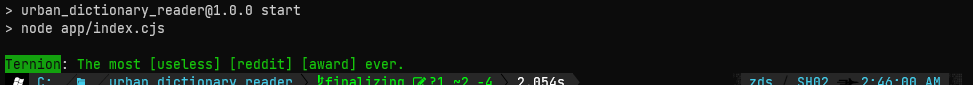

# Urban Dictionary reader

](https://github.com/zskelton/urban_dictionary_reader/actions/workflows/node.js.yml)
]

## Description
A small program to randomly display a message from the Urban Dictionary.


---

**Running the Program:**
```bash
$ node {path to file}/app/index.cjs
```

---

### Reference

[Urban Dictionary](https://www.urbandictionary.com/) is a website that allows users to define words and phrases. This is a simple script that pulls definitions from Urban Dictionary on Login.